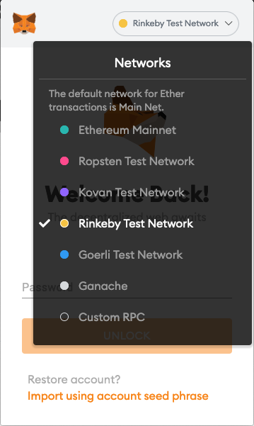
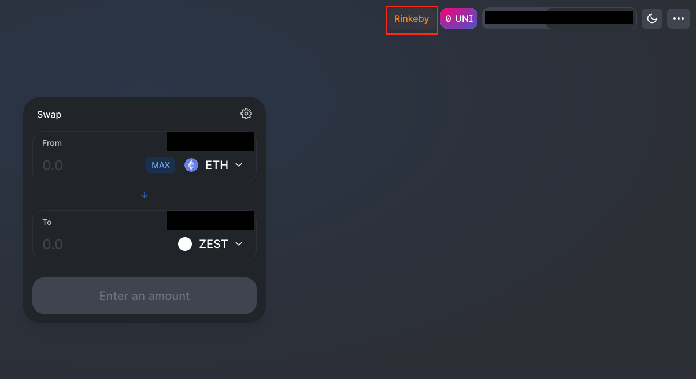
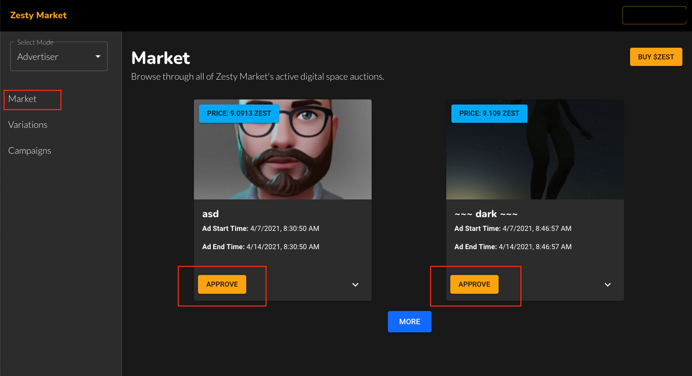
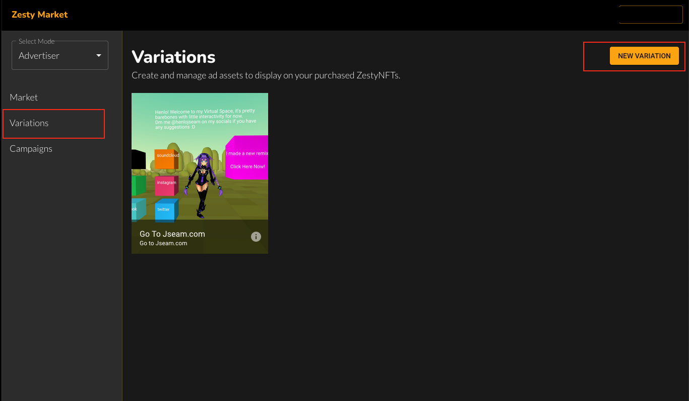
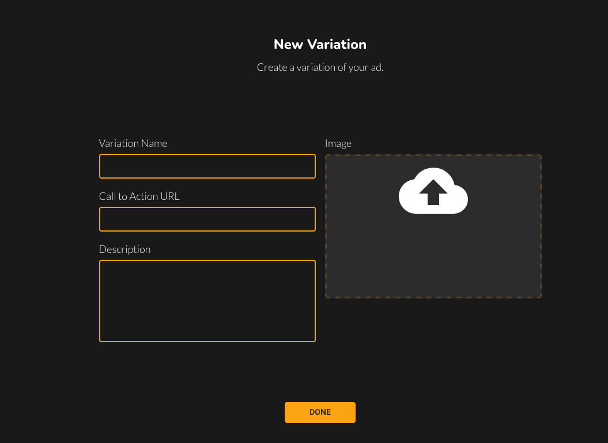
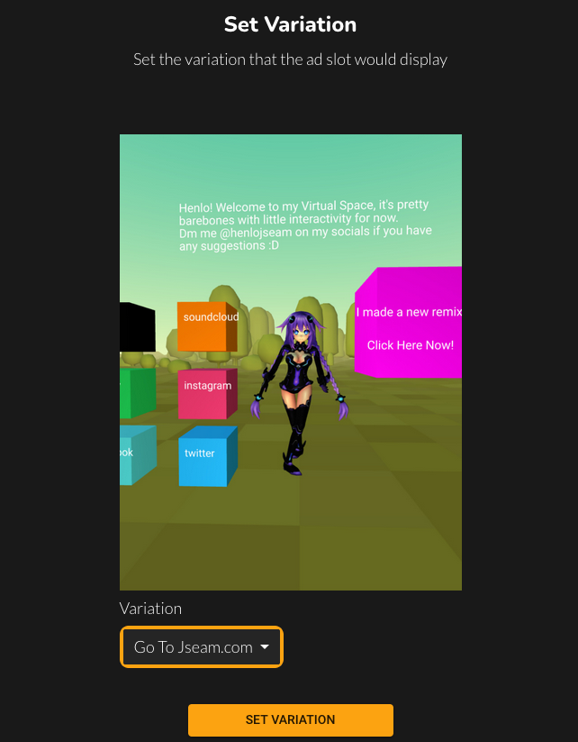

# Advertisers

## Overview

As of April 7, 2021, Zesty Market is live on the Rinkeby testnet and is currently in alpha. The project is undergoing rapid development. Please contact the team on [Discord](https://discord.com/invite/hSXTGvAcSs) for the team for support.  

## Steps to Advertise using Rinkeby Testnet

### Step 1. Set Up MetaMask

[Download MetaMask](https://metamask.io/download.html)

MetaMask is a browser-based extension that would provide you with an Ethereum wallet for use on Zesty Market. Make sure to follow the instructions on MetaMask and store your seed phrase securely. Writing the phrase on paper and storing it in a safe or somewhere secure is a safe way of storing secrets.

### Step 2. Using the Rinkeby Testnet

Once downloaded you will need to switch the network to Rinkeby which is one of the test nets available on Ethereum. No real money will be used on the test net, which makes it a risk-free way of trying out the platform. Switching networks is as easy as going to the top drop-down and selecting Rinkeby Test Network.

You will then need to obtain ether, also known as ETH, the currency used on Ethereum to run any form of transaction. Every transaction consumes an additional amount of ETH \(known as gas\). To obtain test ETH on Rinkeby proceed to [https://faucet.rinkeby.io/](https://faucet.rinkeby.io/). You will need to post your Ethereum address on social media \(Twitter, or Facebook\) and provide the link to the post. The faucet will send test Rinkeby ETH to the address provided. Alternatively, you can contact the team on [Discord](https://discord.com/invite/hSXTGvAcSs) and we will provide you with test ETH.

### Step 3. Buying an Advertising Timeslot

To buy an advertising timeslot you will first need to obtain $ZEST tokens, which is the token native to Zesty Market. [Proceed to Uniswap using the Rinkeby test net to buy $ZEST with the test ETH.](https://app.uniswap.org/#/swap?outputCurrency=0x71d13b5a03967b57dce4b55531487150d2640266) 

You will need to first approve the contract which will allow the Uniswap contract to interact with your tokens. Upon clicking Approve a MetaMask prompt will appear for you to confirm the transaction. 

Once approval is completed, you will be able to swap the desired amount of $ZEST for ETH by clicking on Swap and then confirming on the MetaMask modal. This is the general flow for all smart contract interactions on Ethereum.

**Important: It takes time for the transaction to mine and be processed. Transactions do not happen instantaneously. Be patient while transactions get confirmed. The project will look into fast and reliable chains in the near future. The transactions are not instantaneous.**

With the $ZEST that you have obtained, you can then proceed to [https://app.zesty.market ](https://app.zesty.market)to purchase advertising timeslots. Navigate to Market. Click on approve to approve $ZEST tokens for use by the contracts. If you are using MetaMask a prompt will appear to confirm the transaction. Click on Confirm and wait for the approval to be confirmed. 

Once approved, the Approve button will switch into a Buy Now button. Click on the Buy Now button to buy the advertising time slot. Likewise, click on Confirm on the MetaMask prompt and wait for the transaction to be confirmed.

### Step 4. Preparing Ad Variations for the Campaign

To advertise your desired media on the Advertising timeslot proceed to Variations. Click on New Variation to set a new advertising variation. This variation can be set subsequently on Campaigns where you can see the advertising timeslots you have bought.

After clicking on New Variations, you will be shown the variations form to set a new Advertising Variation. Input all fields. 

Variation Name is the name you can give to the variation. This can be any name to your liking.

Call to Action URL is the URL that users will be directed to when they interact with the advertising time slot listed on the publisher's digital space. 

Description is a brief description of the ad variations. This is meant for your own reference.

Image is the media asset that would be displayed in the publisher's digital space. Ensure that you are posting media assets that the publisher accepts. Otherwise, the publisher has the right to cancel the advertising slot. 

Click on Done when you are finished with the fields.

### Step 5. Setting the Variations on Campaign

Click on Campaigns and you will be able to see the advertising timeslots that you have bought. Click on Set Variations to then set the variation that would be displayed on the Advertising timeslot.

You will be guided to the Set Variation page. Select the variation you want to be displayed and click on Set Variation. A MetaMask prompt will appear to ask for confirmation. Click on Confirm. Once done, the Variation will appear on the digital space at the designated time.

If the advertisement was not successfully displayed you will be refunded a majority of $ZEST tokens. Some $ZEST tokens will be taken by the network for fees. This fee is also meant to discourage malicious advertisers from repeatedly putting ads that publishers do not desire, effectively causing a denial of service for the publisher. The fees will make the denial of service expensive for a malicious advertiser. 

##  

