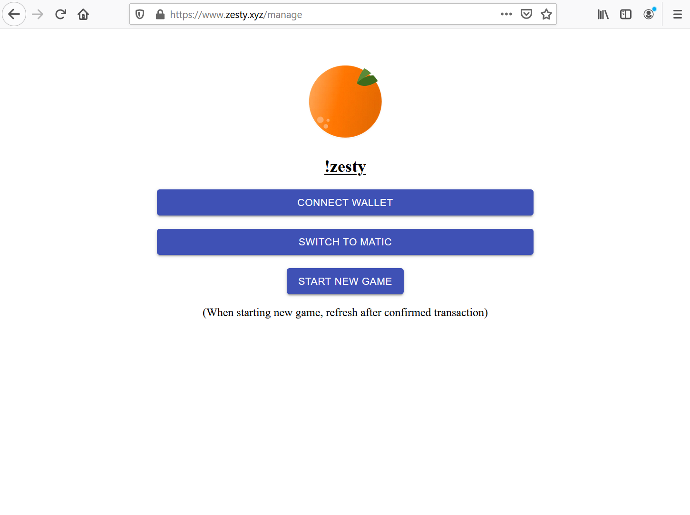
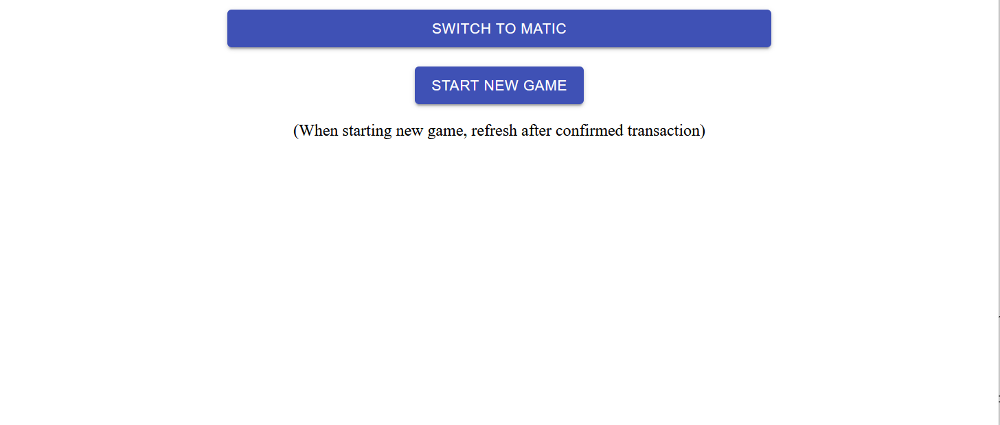
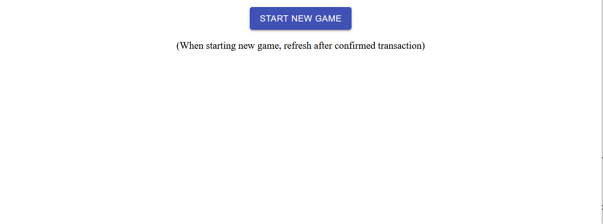
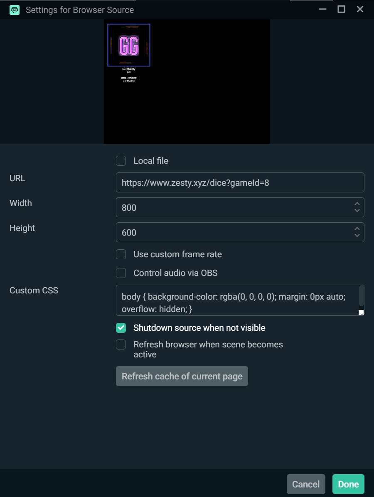
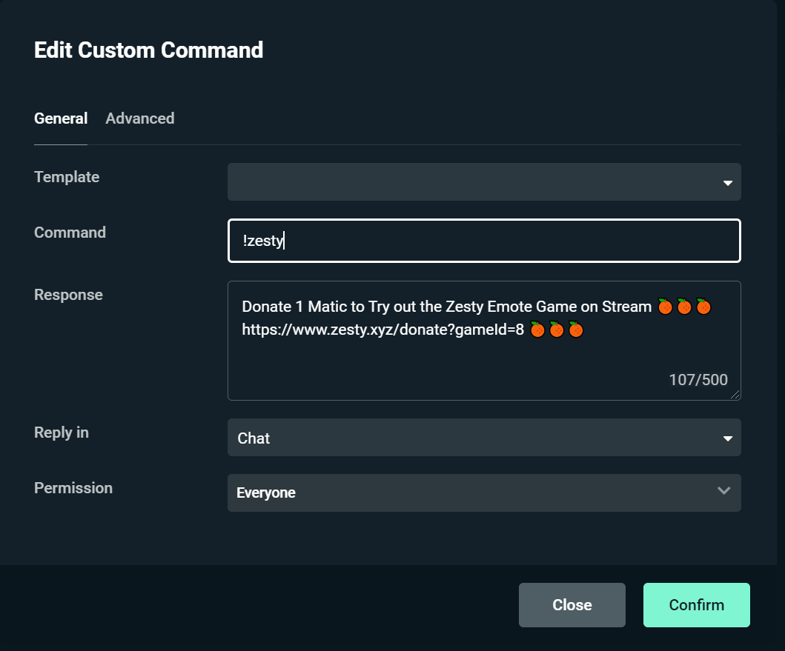
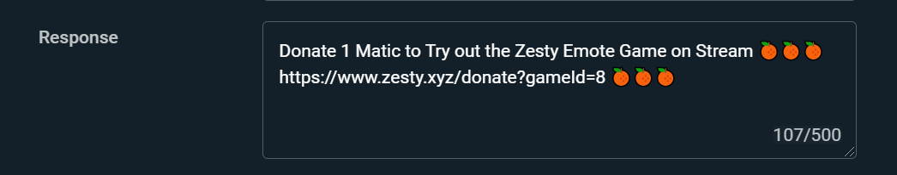
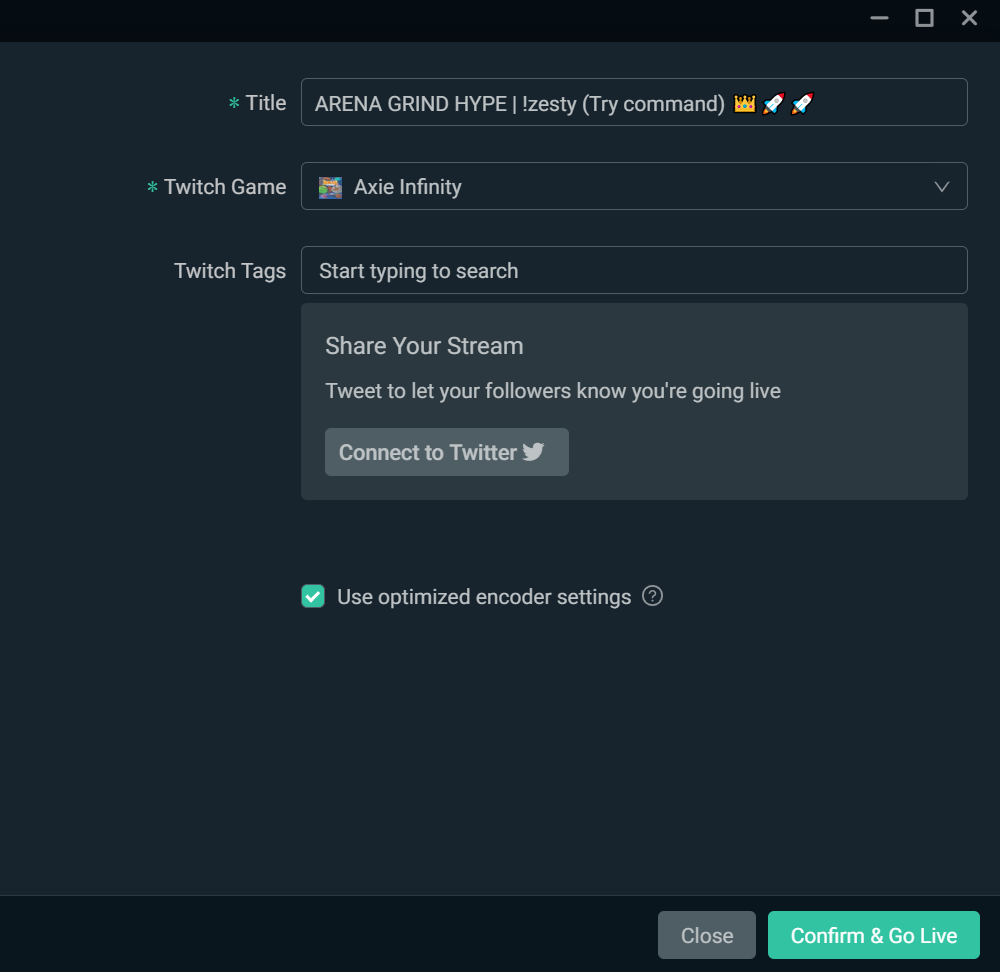
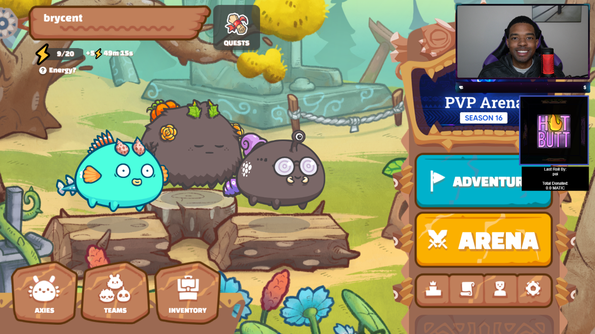

# Dice

## MetaMask Wallet & Initial Game Setup Steps

**Step 1:**

**Go to** [zesty.xyz/manage](https://www.zesty.xyz/manage) and **connect** your MetaMask account by **selecting** the "Connect Wallet" button and **signing** the MetaMask confirmation.

**Step 2:**

**Select** the "Switch to Matic" button and sign the MetaMask confirmation agreement. _\*\*_

\*\*\*\*

**Step 3:**

**Select** the "Start New Game" button and **confirm** the transaction to start a new game. _\*\*`Note: At this time you must have at least 1 Matic in your account to confirm the game transaction and start a new game.`_

\*\*\*\*

**Step 4:**

**Wait** a few seconds and a game number will generate under the "Select Game" header. **Select** the game to get started. _\*\*_

Once you have made it to this point the wallet setup and integration are finished. The next steps will handle configuring the Zesty Dice to go live on your stream.

## Stream Setup Steps

**Step 1:**

Under the game number heading there will be two links. **Copy** the dice game link.

**Step 2:**

**Open** OBS/Streamlabs and **create** a new source. _\*\*_

**Step 3:**

**Select** Browser Source as the new source type and **add** the source. _\*\*_

\*\*\*\*

**Step 4:**

**Paste** the Zesty game dice link into the browser URL, **save** the browser source, and **adjust** the size of the dice game on stream accordingly.

**Step 5:**

**Return** to the [https://www.zesty.xyz/manage](https://www.zesty.xyz/manage) page and **copy** the donate link.

**Step 6:**

**Open** Nightbot or your command bot of choice and **create** a command called !zesty.

**Step 7:**

**Make** the !zesty command description a sentence that **introduces** the zesty dice game as a crypto donation app that **allows** viewers to support their favorite streamer and potentially win prizes.

\*\*\*\*

**Step 8:**

**Add** the "!zesty" command to your stream title and **start** your stream. `For the best result, when interacting with your audience explain the purpose of the zesty dice game and encourage viewers to try the game by offering incentives and prizes.`

**Finished! The end result should look something like this...**

