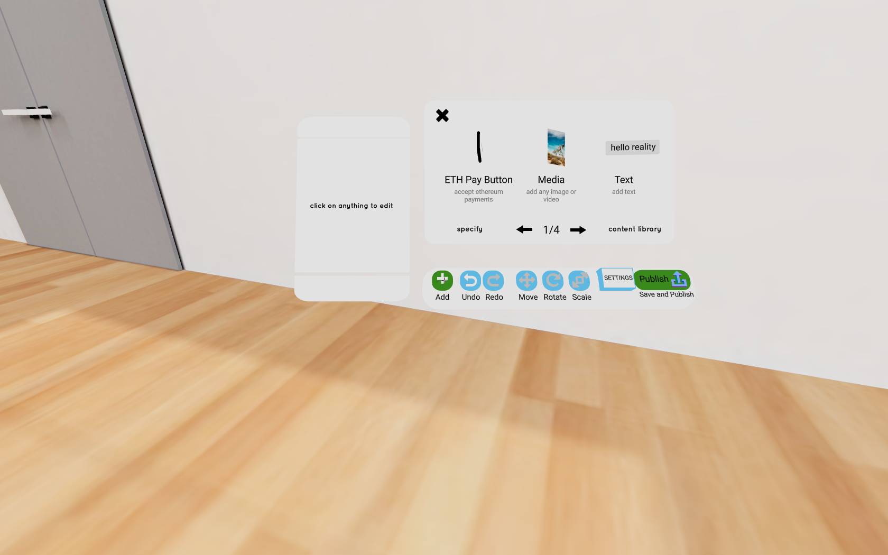
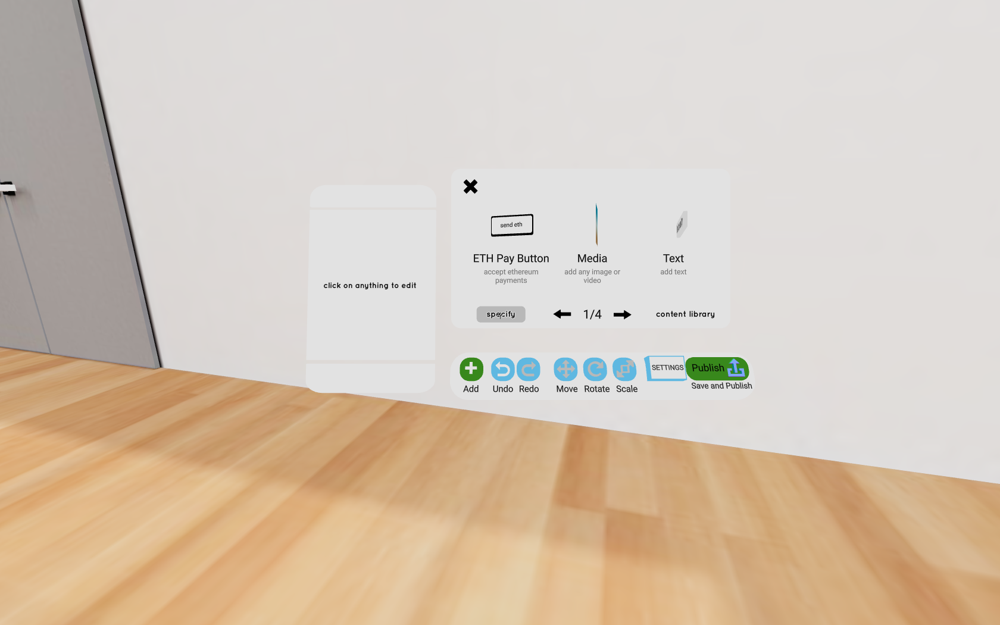
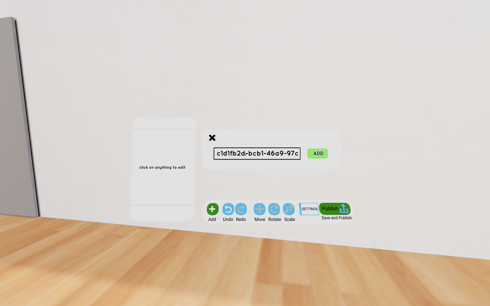
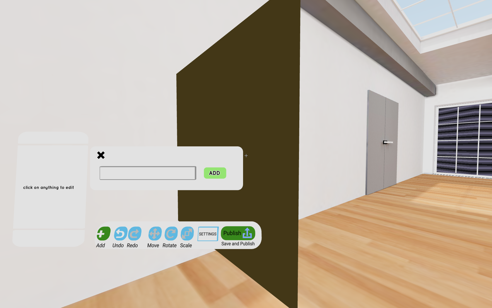
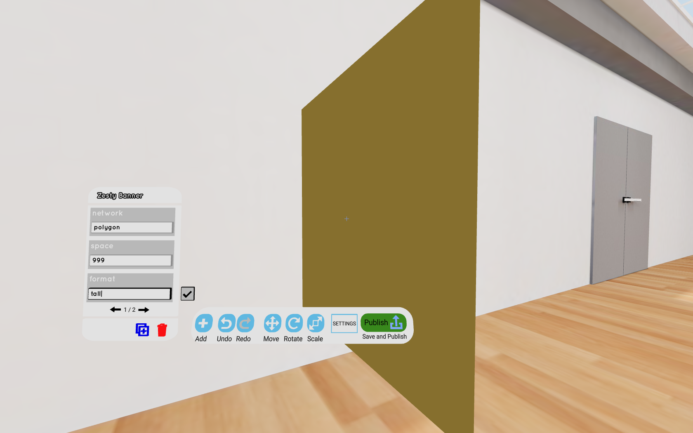
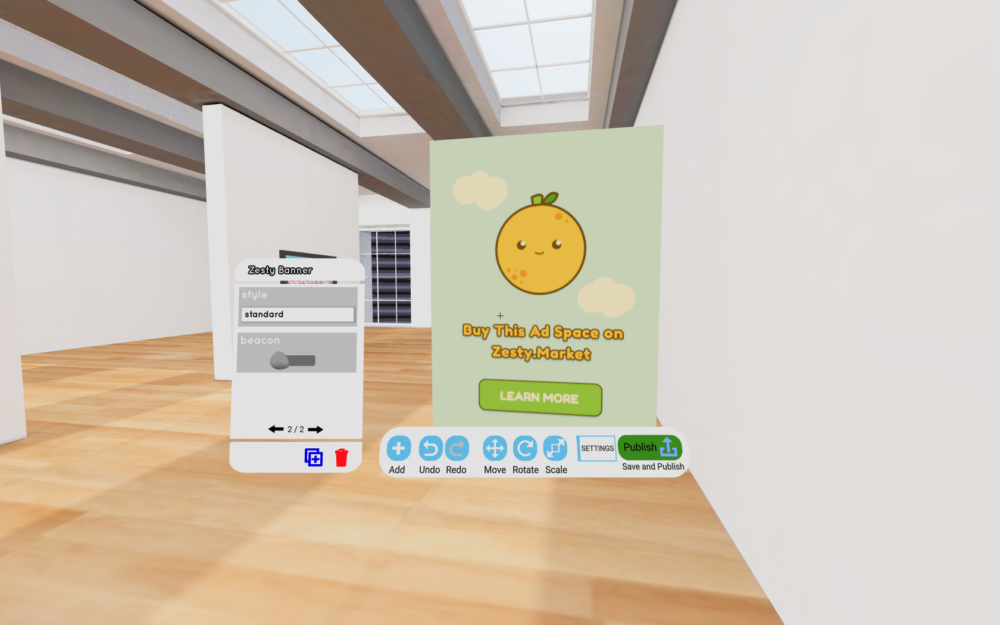

# Muse

## Before You Integrate

You will first need to create a Space NFT in order to get started. Check out "For Creators" for more instructions.


[create-space.md](../create-space.md)


## Instructions

**Step 1**

Log in to Muse and enter builder mode on one of your spaces.

**Step 2**

Press Tab to open the build menu, then click "Add". This shows you the different components you can add to your Muse scene.



**Step 3**

Click "Specify" and then paste in this identifier that corresponds to the Zesty Banner:

```
d351e206-edb0-4278-adc6-5b79d6a91464
```





Click "Add" and you should then see a large black square appear in front of you. This is the banner, which now needs to be configured with the proper settings.



**Step 4**

Select the banner, then fill out the following fields to line up with your space on the Zesty marketplace. Currently you will need to type these fields out manually and in all lowercase, but in the future these will be replaced by dropdown fields. The fields are:

* Network: The network to connect to. Should be either `polygon` or `rinkeby`.
* Space: Your space ID on the marketplace. Should be a number.
* Format: The shape of your banner. Should be `tall`, `wide`, or `square`.
* Style: The style of your default banner when no campaign is currently running on it. Should be `standard`, `minimal`, or `transparent`.
* Disable Beacon: Whether to opt out of sending analytics to Zesty's beacon service.





**Step 5**

Once you have all the options configured, your banner should now be appearing correctly! With that, you've successfully integrated a Zesty Banner into your Muse space. If you'd like to add another banner to the same scene, you can either repeat the process in Step 3 to spawn another, or you can duplicate your existing banner and adjust its settings/properties elsewhere.
