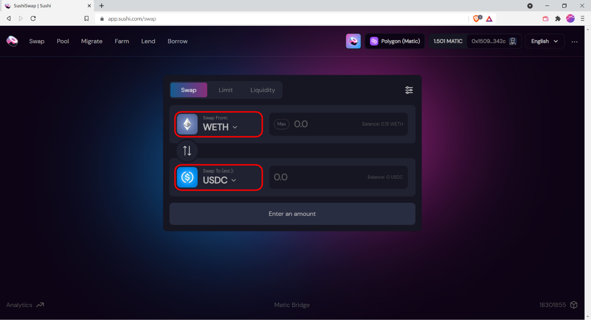

# MetaMask

## Summary

1. Setting up MetaMask
2. Adding Polygon network
3. Buying USDC

## 1. Setting up MetaMask

MetaMask is a browser-based extension that will provide you with an Ethereum wallet for use on Zesty Market. Make sure to follow the instructions on MetaMask and store your seed phrase securely. Writing the phrase on paper and storing it in a safe or somewhere secure is a safe way of storing secrets.

### Download

Go to [https://metamask.io/download](https://metamask.io/download) to find the download link to your device or browser. Click on download.

You'll be directed to the MetaMask extension page on the Chrome Web Store. Click on "Add to Browser"

### Set-up

Once completed you'll see the MetaMask welcome page. Click on Getting Started.


Tip: Pin the extension so you can have a quick access to your wallet.


You'll see the option of "Import wallet" or "Create a Wallet". If you already have a wallet you want to use, go ahead to "Import Wallet". That will prompt you to fill in Secret Recovery Phrase and new password.

If you do not have an Ethereum wallet yet, you may click on "Create a Wallet".

Create a password when prompted. Read and watch the video on how you can secure your wallet. Once done, click Next.


Your recovery phrase is the “master key” to your wallet and funds.\
**NEVER share your recovery phrase** with anyone, not even with MetaMask!\
Do not keep the phrase in digital format.


You'll see your Secret Recovery Phrase here. Write down the Secret Recovery Phrase. Keep it offline, do not screenshot, or save the phrase in your computer or on the cloud.

On the next page, you'll be prompted to re-create the phrase, click on the words in order of the Secret Recovery Phrase you were given earlier.

When you correctly arranged all the words, click on Next and you are done!

You can check your wallet from the extension section.

## 2. Adding Polygon network

To add Polygon to your MetaMask, go to your MetaMask, click on Network selection dropdown, click on Custom RPC.

Fill in below information:

* **Network Name**: `Matic Mainnet` or `Polygon`
* **New RPC URL**: `https://rpc-mainnet.maticvigil.com/`
* **Chain ID**: `137`
* **Currency Symbol (optional)**: `MATIC`
*
    ****

    **Block Explorer URL (optional)**: `https://polygonscan.com/`

And click Save when you're done! You'll be switched to Polygon network when you're done.

You may switch to other networks at anytime by clicking on the network name on the network dropdown.

### **Watch our video to see the entire process** 



### **Getting Matic from Matic Faucet**

Matic is the currency token for the Polygon Network, you will need some to pay for gas fees. Luckily, the gas fee on Polygon is cheap and there are faucets that will send you free Matic to get you started. One of the faucet is provided by Mac\&Cheese Finance.

1. First, go to [https://macncheese.finance/matic-polygon-mainnet-faucet.php](https://macncheese.finance/matic-polygon-mainnet-faucet.php)
2. Copy your wallet address (Ethereum mainnet and Polygon wallet uses the same address).
3. Paste your wallet address to the Wallet Address field
4. Solve the captcha
5. Click on "Send Matic"

If you're unable to get the faucet to work, feel free to contact any of Zesty member. We'll be happy to assist you in getting some Matic to get your started!

## 3. Buying USDC

To buy an advertising timeslot you will first need to obtain USDC token, which is the token currently used by Zesty Market.

The overview of the steps to buying USDC:

1. Buy ETH from your preferred exchange
2. Send the ETH to your MetaMask wallet
3. Transfer the ETH from the Ethereum mainnet to Polygon network via Matic Bridge
4. Swap ETH for USDC on Sushi Swap

### Getting ETH

First you'll need to load up your wallet with ETH. You can do so by buying ETH on exchanges such as [Coinbase](https://www.coinbase.com) or [Binance](https://www.binance.com/en). You can then transfer the ETH to your Metamask wallet. To find your wallet address, refer below image:

### Send ETH from Mainnet to Polygon

Once you have the ETH in your MetaMask wallet, you'll need to send the ETH from Ethereum mainnet to Polygon Network via [Matic Bridge](https://wallet.matic.network/bridge/).


The transaction could take a while, depending on how much gwei (gas fee) you allocated for your transaction. The higher you allocated, the faster the transaction will be.

Please while transactions get confirmed. The project will look into fast and reliable chains in the near future.


### Swapping ETH for USDC

When you have your ETH in Polygon network, you may now go to [https://app.sushi.com/swap](https://app.sushi.com/swap) to swap ETH for USDC. Make sure you are in Polygon network (go to your MetaMask wallet, click on the network dropdown on top of the wallet, click and choose Polygon network that you have set up earlier)

.png>)

Next, you'll want to choose Swap from as **WETH** and swap to as **USDC**.

Once you've chosen the right tokens (WETH and USDC), choose the amount of ETH you want to swap or the amount of UDSC you want to swap to. Whichever you choose, the platform will auto-calculate how much you'll swap for.

Click on **Confirm Swap**.

.png>)

MetaMask pop-up window will appear, to confirm your transaction, click on **Confirm**.

You'll also be given an option to add USDC token to your MetaMask, click **Confirm**. This will allow you to see how much USDC you have in your wallet.


This will confirm your transaction and it might take a while for your transaction to complete


Once the transaction is done, you'll see a small pop-up on your screen. You can also check your USDC balance on your MetaMask wallet.&#x20;

Awesome. You've done with the pre-requisites!
