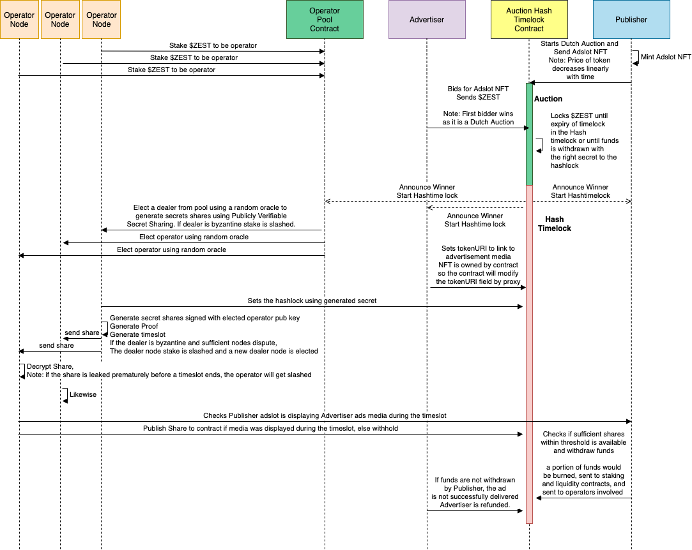

# Litepaper

## Abstract

Zesty Market is a monetization platform for Internet communities, owned by Internet communities. Our goal is to provide creators with a method of capturing the value that they create without dependence on a centralized platform.

Our first product is an alternative to centralized advertising networks that have come to extract an outsized amount of value from creators. Twitch takes 50% of all revenue from subscriptions, and YouTube only shares 30-40% of the ad revenue with its video creators. Sometimes, these platforms have been known to outright demonetize the creator, where the person is no longer able to earn an income from the content that they create. We think that these platforms have too much power over the livelihoods of people.

At our current iteration of the product, Zesty enables tokenization of digital ad spaces, whether it's in VR or a section of a livestream into an NFT. The NFT can be rented out to an advertiser. The revenue from the rental would go directly to the creator on-chain. Zesty Market will generate revenues from fees. We plan to offer the product first for the WebXR market, but will be expanding to other platforms.

Zesty will exit to the community, which means that one day we will be owned by our most loyal users, which will include creators and advertisers. So instead of having to purchase shares of Google \(who owns YouTube\) or Amazon \(who owns Twitch\), people will be able to grow their ownership share in Zesty just by using it. With a financial and attention ecosystem that would be favorable for creators, Zesty Market will pave the way for the future metaverse \(whatever this might be\), where everyone has a stake.

## Scarcity and Cash Flow

Human attention has value because people can only pay attention to few things at once. Advertisers pay for this scarcity because advertisements can influence the person into spending their money on the product being advertised. This is obvious, so we'll move onto why Zesty will be using NFTs.

Fundamentally, NFTs are useful for representing assets that are scarce or one-of-a-kind. NFTs provide a nice way to find out who owns something digital, and to pay the person for its use or full ownership. It makes sense for creators to tokenize their ad opportunities as NFTs, as this allows anyone in the world with an Internet connection and MetaMask wallet to purchase the ad slot, while also allowing the creator to participate in the growing DeFi ecosystem to earn yield with their Zesty NFT.

Zesty NFTs have the capacity to generate cash flow, which makes valuation of these NFTs more predictable with traditional financial models. While the NFT is being continually rented out on the market, there will always be a floor price for the asset. While we don't think that Zesty NFTs will be transferred often from one person or entity to another, the ability for our NFTs to generate revenue by the virtue of being a surface for ads is a unique idea that the NFT ecosystem has not seen before.

We foresee a future where it might be possible to sell an online business through a transaction on a blockchain, by transferring a revenue-accruing NFT and its related ENS domains. While we are excited by all of the cool things that DeFi has to offer, DeFi needs real businesses building on top of the new financial system that need the leverage DeFi provides to borrow and grow. What we are building at Zesty Market touches upon the potential to put entire digital businesses on-chain.

## Metaverse

The metaverse, in our opinion, is wherever people spend their time and resources in the virtual world. The time and resources may be used to form friendships, build ideas, craft virtual goods, increase social clout, and exercise their influence. It is already happening today on platforms like Discord and Twitter. We see these platforms already as the "metaverse".

WebXR is a device API for AR and VR hardware to be able to interact with immersive Web experiences. With the growth of VR headsets and openly distributed WebXR experiences on the Web and platforms like [SideQuest](https://sidequestvr.com/), there is a growing need for an open monetization mechanism. With the development of a WebGPU API, the web will become a compelling medium to build spatial experiences on and become a competitive option to native experiences.

Zesty Market recognizes that the WebXR space is presently small despite future potential. As such the project will look into other verticals in the metaverse economy, like streaming \(Twitch, YouTube Live, etc.\).

## How it Works \(WIP\)

In online advertising, there are three key stakeholders: Advertisers, Publishers/Creators, and Consumers. Advertisers buy advertising slots from publishers to leverage their reach in order to get information out to consumers. This structure is the basis of the attention economy that the internet is built upon. In the Web 2.0 model, the relationship between the key stakeholders is mediated by a centralized third party who mediates the flow of money as well as the flow of attention. Zesty Market proposes a decentralized structure for how this could be implemented.

The sale and fulfillment of the advertising slot are done in two parts:

1. A Dutch Auction for price discovery of the advertising slot
2. A Hash Timelock Contract augmented with Publicly Verifiable Secret Sharing \(PVSS\) for decentralized validation of the advertising slot. 

By treating the serving of media on an advertising slot as a delivery vs payment \(DvP\) problem, the system is able to facilitate value transfer in a decentralized way. Profits from the auction are redistributed to stakers \(validators and nominators\). Fraud is disincentivized through cryptoeconomic mechanisms.

## Dutch Auction of NFT Advertising Timeslots

Zesty Market uses a Dutch Auction for price discovery of advertising timeslots. Publishers/Creators on Zesty Market would need to first create advertising slots by minting non-fungible tokens \(NFT\) that would represent timeshares of an advertising space that the publisher owns. Once the advertising slots have been minted, the publisher can create a Dutch auction for the NFT for bidding by advertisers. As the NFT represents a timeshare, the value of the NFT would decrease and approach zero as it reaches the end of the timeslot. The value of the NFT on the Dutch auction is represented by a linearly decreasing function as follows:

$$V(T_{i}) = V(T_{0}) - (T_{i} - T_{0}) \times \frac{V(T_{0})}{T_{0} - T_{n}}$$

**Definitions**

$$V(T_i)$$refers to the current NFT price in some ERC20 tokens

$$V(T_{0})$$refers to the starting price of the NFT in ERC20 tokens

$$T_i$$refers to the current time in Unix time

$$T_0$$refers to the starting time of the Dutch auction in Unix time

$$T_n$$refers to the expiration time of the NFT timeslot in Unix time

When an advertiser bids for the NFT, the Dutch auction concludes and the system proceeds to the next phase which is the Hash Timelock phase. The funds that are used for bidding would be locked in the Hash Timelock. No funds will be transferred until the successful conclusion of the Hash Timelock phase.

An expiration time for the Dutch auction can be set to an appropriate time order to prevent pointless bidding. The default expiration time is 1 hour before the expiration of the advertising slot. An example of pointless bidding is as follows. For example, bidding for 1 minute prior to the expiration of the advertising. Due to block confirmation times, it can be difficult to fulfill an advertising service within 1 minute. As such, the default expiration time of the Dutch auction is set at 1 hour before the expiration of the NFT timeslot.

## Hash Timelock Contract with Publicly Verifiable Secret Sharing for Advertising Services

To mediate the successful completion of advertising service. It is possible to model the system as a delivery vs payment \(DvP\) problem. DvP is formerly a term used in security settlements to guarantee that the transfer of payment is made only when the transfer of a security is made. In the case of advertising, it is analogous to the payment for advertising slots when the advertising service concludes. We will first discuss the case of securities settlements, this can be implemented using a Hash Timelock Contract.

### **Hash Timelocks explained**

The Hash Timelock Contract is a vault containing a Hashlock and a Timelock, this ensures that two parties are able transfer funds securely without intermediaries. The normal flow for a Hash Timelock Contract is as follows:

1. Alice locks A-tokens a vault and sets a timelock and a hashlock. The timelock prevents a party from withdrawing funds prior to expiration, and the hashlock is simply a hash of a secret.
2. Bob locks B-tokens into a vault and sets a timelock and copies the hash of the hashlock of Alice's vault into his vault.
3. Alice claims B-tokens from Bob's vault by revealing the secret which unlocks the hashlock.
4. Bob now knows the secret and unlocks funds from Alice's vault. Note that Alice could not withdraw funds yet as the timelock is still present.
5. If Alice does not claim the funds, the timelock expires for both vaults and the transfer is canceled.

In the case of security settlements or token transfers, the flow mentioned above is sufficient. However, an immediate problem emerges in the case of advertising services where one side possesses an asset to be transferred while the other is providing a service. There is an added complication of guaranteeing that a time-based service should be completed.

In the usual Web2.0 fashion, the guarantee is usually done by a centralized 3rd party who would mediate any anomalies. However, using cryptography techniques we are able to disintermediate the centralized 3rd party into a decentralized one using Publicly Verifiable Secret Sharing.

### **Publicly Verifiable Secret Sharing explained**

Publicly Verifiable Secret Sharing, split into two processes. Secret sharing, and verifying the secret shares in a public way. While tautological, it is not necessarily intuitive.

Secret shares are a way of distributing a secret into multiple parts, such that when you obtain sufficient amount of shares you would be able to obtain the original secret. In Zesty Market's case, this secret is used to unlock the hashlock which will contain the locked funds from the Dutch Auction which is held in the Hash Timelock contract described in the previous section. The effect of converting the secret for the hashlock into secret shares allows for the tokenization of time into a cryptographic object.

Upon successful advertisement at a random timeslot, a secret share will be revealed by a random validator node. When enough secret shares are known the publisher would be able to obtain the secret that would unlock the hashlock in the vault. If the publisher does not advertise successfully the publisher will not be able to obtain sufficient shares to obtain the secret to unlock the vault. The advertiser would then be refunded at the end of the timelock.

To decentralize the secret-sharing process. The protocol will introduce multiple operator/validator nodes which will be in charge of the validation process. A random subset of validators will be elected for each hash timelock contract.

\(TO DESCRIBE FURTHER\)

**Protocol Design**

## Operator Node Implementation

### Dealer Mode

### Operator Mode

Selenium + Computer Vision based verification system

